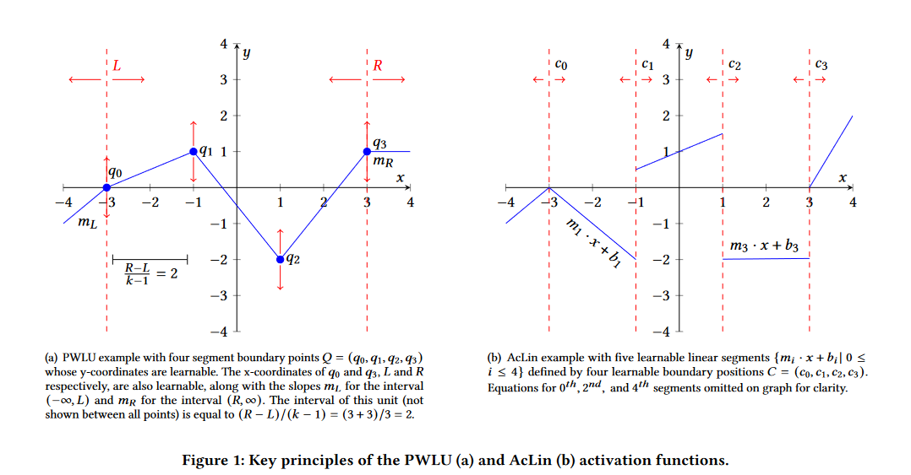

# Inferred Activations (Activation Linearizer)

An attempted exploration of what a dynamic activation function would look like. 

ActivationLinearizer, the proposal, attempts to train both the line segments which composes the linearized function (sigmoid, tanh, etc) and the boundaries of the line segments.
Since linear boundary segments are not differentiable, this work explored assigning/defining a simple "x" derivative to boundaries.
Exploration of defining this derivative was limited to simply scaling the derivative with the distance of a boundary to surrounding boundaries, but that was found to be ineffective/unneeded.

Activation Linearizer (AcLin or AL) was compared to the [Piece Wise Linear Unit (PWLU)](https://arxiv.org/abs/2104.03693) and Non-uniform Piece Wise Linear Unit (NUPWLU) and found middling advantage compared to them.
AcLin is more effective than PWLU because it requires less training (PWLU needs a statistical analysis period of at least one epoch before beginning "true" training). 
However, NUPWLU is more effective because it emulates AcLin's dynamic boundary size while not needing a "predefined derivative".
PWLU was written in Tensorflow with inspiration from [MrGoriay's Pytorch implementation](https://github.com/MrGoriay/pwlu-pytorch/blob/main/PWLA.py).

This research was part of an Undergraduate Grant/Fund sponsored and supervised by Dr. Philip Brisk from University of California, Riverside.
